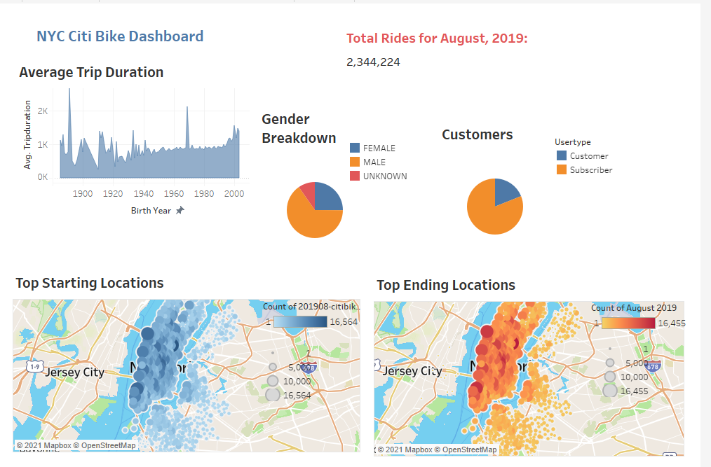
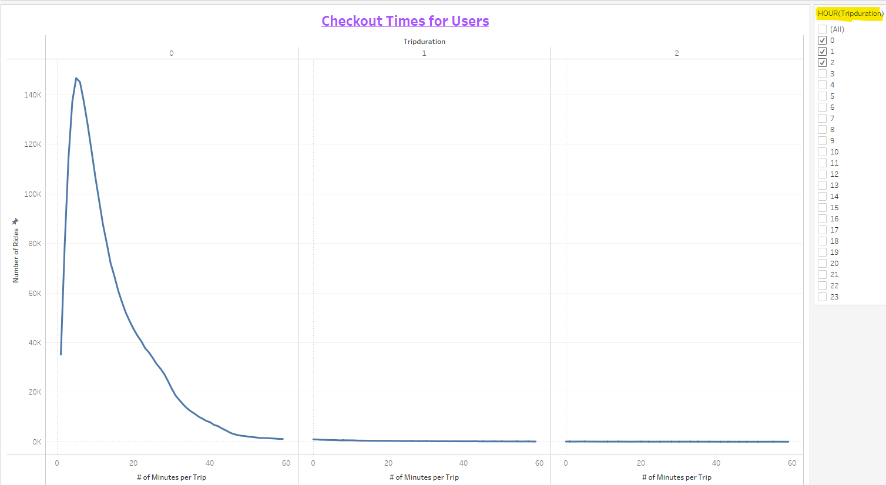
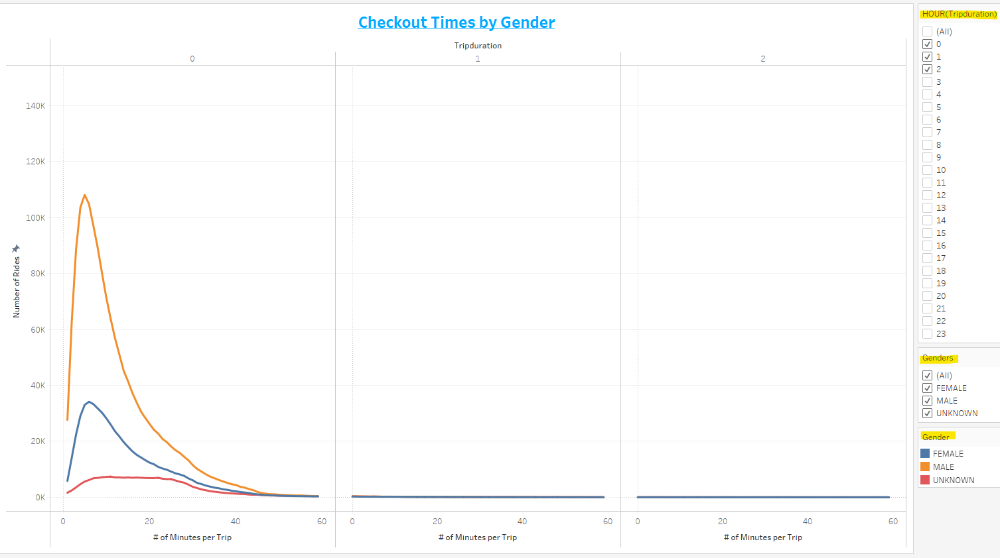
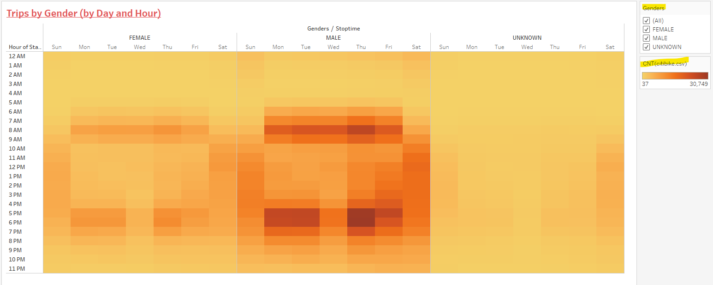
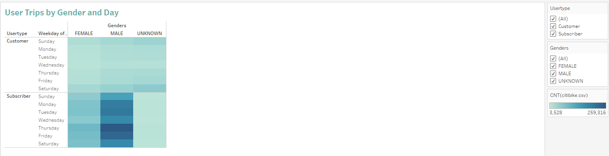
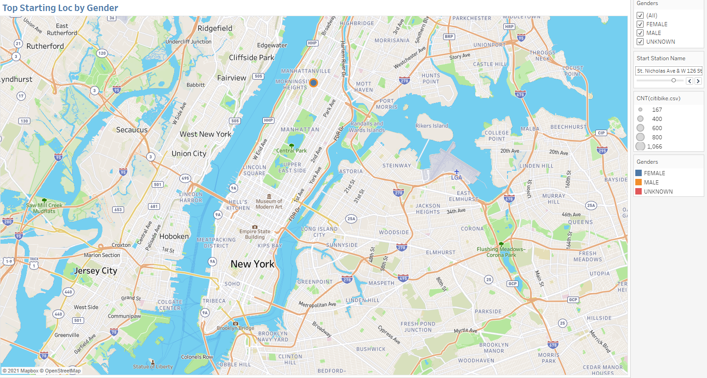
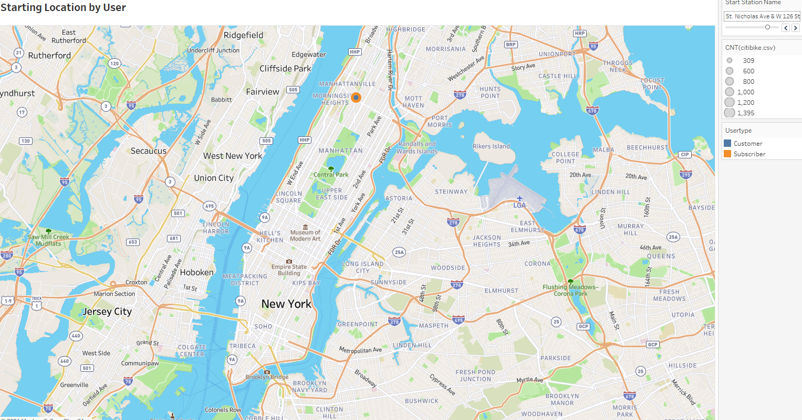

### bikesharing -> Module 14
# New York City Citi Bike Analysis

## NYC Citi Bike Overview
My client and friend Kate is interested in opening up bike rental kiosks in the Des Moines, Iowa.
Citi Bike rental data has been released to the public and Kate and I are able to use the data for our analysis using the Tableau application. 
We will need to be make sure we apply the data from NYC appropriately to Des Moines given the many differences including size of city, culteral and tourism rates.
We started with the following dashboard:

Tableau was used to create 7 graphs that represent some of the data:
### 1. Checkout Times for Users
### 2. Checkout Times by Gender
### 3. Trips by Day and Hour
### 4. Trips by Gender by Day and Hour
### 5. User Trips by Gender and Day
### 6. Starting Location by Gender
### 7. Starting Location by User (Customer or Subscriber)

## NYC Bike Analysis Results
The analysis of the Citi data shows the following:

- Looking at all of the length of trips, even upon filtering variious amounts of time, most are under an hour. 
It may be worthwhile to investigate the price of rentals and if the rate could be decreased for additional hours of rental to understand this trend.

- To understand more about our riders we can look at the gender of our riders which only echos that of all riders.  There is not much difference between 
men and women accept that we can see men are definitely outnumber women as customers.

- In looking at the days of the week we can see that ridership increses during peak rush hours. 
On the weekend, as would be expected, riders use the bikes during the entire day.

- And the gender breakdown only echos this pattern. It is interesting that there seems to be a lull on Wednesday evenings.

- There are more subscribers than customers and we can see again that male renters outnumber female renters. 
There my be an opportunity to increase female ridership through marketing. 

- To gain more knowledge of our base riders, we can use the slider to navigate to each of the starting locations 
to see the number of male vs female at each location.

- As well, we can see who are subscribers vs customers per location.

## NYC Citi Bikerental Summary
There is a lot to learn by looking at the Citi bikeharing data. But we need to take apply this to our Des Moines area.

### Addtional analysis for Des Moines area rentals:

Here are some possible additional uses for the module with somewhat easy modifications:
1) What is the population difference between Des Moines and NYC and where are the most densely populated areas?

2) What kind of tourism does Des Moines have and where are is it located?

3) Are there outdoor areas where bike rentals could be placed.

4) Are there Universities or Colleges where bike kiosk's could be placed?

5) We need to indentify additional differences between NYC and Des Moines to better understand our potential clientelle.

## Resources
- Data Source: citibike-tripdata.csv
- Software: Tableau 2021.2.0
